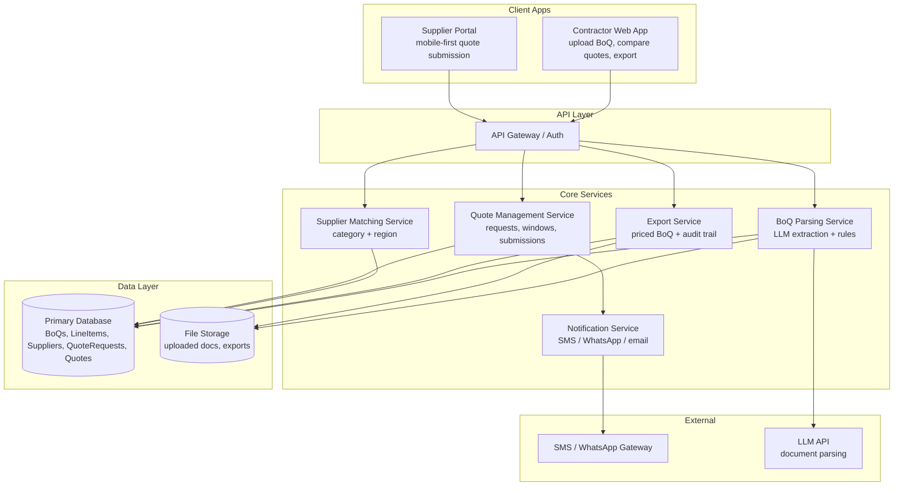

# Tenderpreneur Architecture

## Architectural style

Use a modular full-stack application with a clear API boundary.



## Layer responsibilities

### Client apps

One web application can initially expose two role-specific experiences:

- Contractor portal.
- Supplier portal.

Do not create two independently deployed frontends unless there is a concrete reason.

### API layer

Responsible for:

- Authentication.
- Authorization.
- Request validation.
- Rate limiting.
- Routing.
- Consistent error responses.

### Core services

Keep domain modules separated even if deployed as one backend process in MVP.

Suggested backend modules:

```text
boq/
quotes/
suppliers/
matching/
exports/
notifications/
audit/
auth/
files/
parsing/
```

### Data layer

PostgreSQL stores transactional entities and audit events.

Object storage stores:

- Original BoQ files.
- Intermediate parsed documents if needed.
- Generated PDF/Excel exports.

Do not store large binary documents directly in PostgreSQL.

### External services

Wrap external providers behind interfaces:

- `LLMProvider`
- `ObjectStorageProvider`
- `NotificationProvider`
- `ExportRenderer`

This keeps local development testable and makes providers replaceable.

## Deployment model for MVP

Start as:

- One frontend deployment.
- One API deployment.
- One PostgreSQL instance.
- One object-storage bucket.
- Optional worker process for asynchronous jobs.

Do not prematurely split every core service into separate microservices. The service boxes represent domain boundaries, not a requirement for separate deployments.
